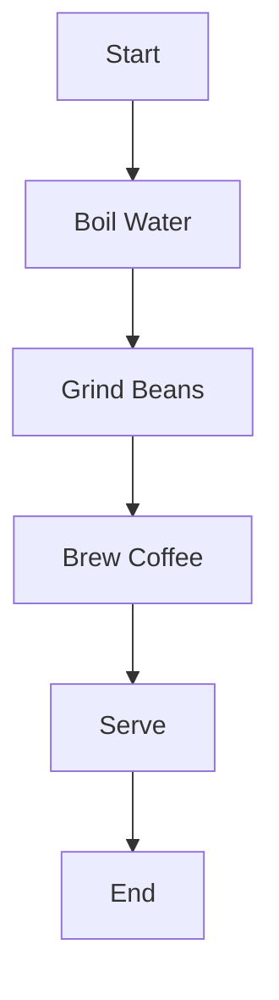
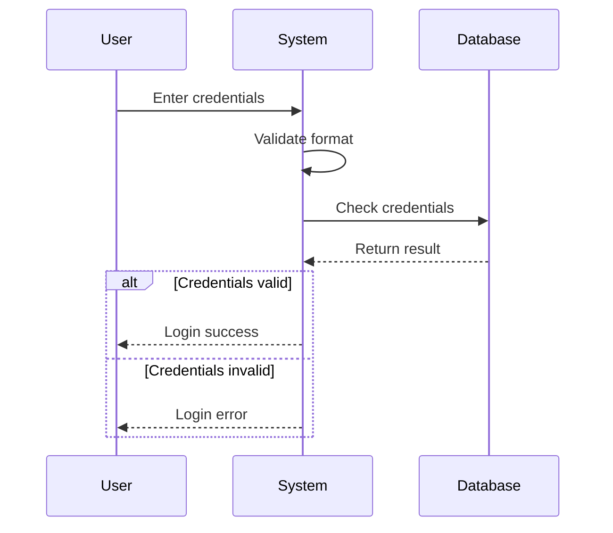
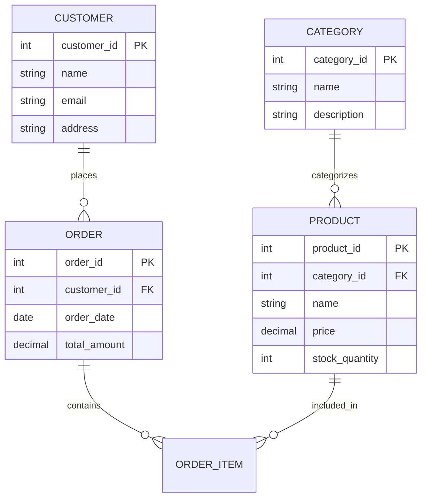

# Mermaid Diagram Generator

🚀 **Transform natural language into beautiful diagrams using AI**

This application uses Google's Gemini AI to convert plain English descriptions into Mermaid.js diagram code, making it easy to create professional diagrams without learning complex syntax.

## ✨ Features

- **AI-Powered Generation**: Convert natural language to Mermaid.js diagrams using Google Gemini
- **Multiple Diagram Types**: Support for flowcharts, class diagrams, sequence diagrams, ER diagrams, state diagrams, and Gantt charts
- **Real-time Preview**: Instant diagram rendering with Mermaid.js
- **Code Export**: Copy generated Mermaid code or download diagrams as SVG
- **Smart Validation**: Automatic syntax validation and error handling
- **Responsive Design**: Works seamlessly on desktop and mobile devices
- **Example Templates**: Quick-start examples for common diagram types

## 🎯 Supported Diagram Types

| Type | Description | Use Cases |
|------|-------------|-----------|
| **Flowchart** | Process flows and decision trees | Business processes, algorithms, workflows |
| **Class Diagram** | Object-oriented design relationships | Software architecture, inheritance models |
| **Sequence Diagram** | Time-ordered interactions | API calls, user interactions, system communications |
| **Entity Relationship** | Database schemas and relationships | Database design, data modeling |
| **State Diagram** | State machines and transitions | Workflow states, system lifecycle |
| **Gantt Chart** | Project timelines and scheduling | Project management, timeline planning |

## 🚀 Quick Start

### Prerequisites

- Node.js 16.0 or higher
- Google Gemini API key

### Installation

1. **Clone the repository**
   ```bash
   git clone https://github.com/rajeshuriti/llm-demo.git
   cd llm-demo
   ```

2. **Install dependencies**
   ```bash
   npm install
   ```

3. **Set up environment variables**
   ```bash
   cp .env.example .env
   ```

   Edit `.env` and add your Google Gemini API key:
   ```env
   GEMINI_API_KEY=your_gemini_api_key_here
   PORT=3000
   NODE_ENV=development
   ```

4. **Start the application**
   ```bash
   npm start
   ```

5. **Open your browser**
   Navigate to `http://localhost:3000`

### Development Mode

For development with auto-reload:
```bash
npm run dev
```

## 📖 Usage Examples

### Example 1: Simple Flowchart
**Input:** "Create a flowchart showing the process of making coffee: start, boil water, grind beans, brew coffee, serve"

**Generated Mermaid Code:**


### Example 2: User Authentication Sequence
**Input:** "Show the sequence of user login: user enters credentials, system validates, checks database, returns success or error"

**Generated Mermaid Code:**


### Example 3: E-commerce Database
**Input:** "Design an entity relationship diagram for an online store with customers, orders, products, and categories"

**Generated Mermaid Code:**


## 🔧 API Documentation

### Generate Diagram
**POST** `/api/diagrams/generate`

Generate a Mermaid diagram from natural language description.

**Request Body:**
```json
{
  "description": "Create a flowchart showing user registration process",
  "diagramType": "auto"
}
```

**Parameters:**
- `description` (string, required): Natural language description (10-2000 characters)
- `diagramType` (string, optional): Diagram type (`auto`, `flowchart`, `class`, `sequence`, `er`, `state`, `gantt`)

**Response:**
```json
{
  "success": true,
  "data": {
    "mermaidCode": "graph TD\n    A[Start] --> B[End]",
    "diagramType": "flowchart",
    "generationTime": "1250ms",
    "warnings": []
  },
  "metadata": {
    "inputLength": 45,
    "outputLength": 156,
    "timestamp": "2024-01-15T10:30:00.000Z"
  }
}
```

### Validate Diagram
**POST** `/api/diagrams/validate`

Validate Mermaid diagram syntax.

**Request Body:**
```json
{
  "mermaidCode": "graph TD\n    A[Start] --> B[End]"
}
```

**Response:**
```json
{
  "success": true,
  "data": {
    "isValid": true,
    "codeLength": 156,
    "lineCount": 2
  }
}
```

### Get Examples
**GET** `/api/diagrams/examples`

Retrieve example descriptions and diagram types.

**Response:**
```json
{
  "success": true,
  "data": [
    {
      "id": 1,
      "title": "Simple Process Flow",
      "description": "Create a flowchart showing...",
      "expectedType": "flowchart",
      "category": "process"
    }
  ]
}
```

### Get Supported Types
**GET** `/api/diagrams/types`

Get list of supported diagram types.

**Response:**
```json
{
  "success": true,
  "data": [
    {
      "type": "flowchart",
      "name": "Flowchart",
      "description": "Process flows, decision trees, workflows",
      "syntax": "graph TD or graph LR",
      "useCase": "Business processes, algorithms, decision making"
    }
  ]
}
```

## 🛠️ Configuration

### Environment Variables

| Variable | Description | Default |
|----------|-------------|---------|
| `GEMINI_API_KEY` | Google Gemini API key | Required |
| `PORT` | Server port | 3000 |
| `NODE_ENV` | Environment mode | development |
| `RATE_LIMIT_WINDOW_MS` | Rate limit window | 900000 (15 min) |
| `RATE_LIMIT_MAX_REQUESTS` | Max requests per window | 100 |
| `ALLOWED_ORIGINS` | CORS allowed origins | localhost:3000 |

### Gemini API Configuration

The application uses Google's Gemini Pro model with the following settings:
- **Temperature**: 0.1 (for consistent, deterministic output)
- **Max Output Tokens**: 2048
- **Safety Settings**: Medium and above blocking for harmful content

## 🧪 Testing

Run the test suite:
```bash
npm test
```

The tests cover:
- API endpoint functionality
- Input validation
- Error handling
- Mermaid syntax validation
- Rate limiting

## 📁 Project Structure

```
mermaid-diagram-generator/
├── config/
│   └── config.js              # Application configuration
├── middleware/
│   └── errorHandler.js        # Error handling middleware
├── public/
│   ├── index.html            # Main web interface
│   ├── styles.css            # Application styles
│   └── app.js                # Frontend JavaScript
├── routes/
│   └── diagramRoutes.js      # API route handlers
├── services/
│   └── geminiService.js      # Gemini API integration
├── tests/
│   └── api.test.js           # API tests
├── utils/
│   ├── validation.js         # Input validation utilities
│   └── logger.js             # Logging utilities
├── .env.example              # Environment variables template
├── package.json              # Dependencies and scripts
└── server.js                 # Main server file
```

## 🔒 Security Features

- **Input Sanitization**: All user inputs are sanitized to prevent injection attacks
- **Rate Limiting**: API endpoints are rate-limited to prevent abuse
- **CORS Protection**: Configurable CORS settings for secure cross-origin requests
- **Content Security Policy**: CSP headers to prevent XSS attacks
- **Input Validation**: Comprehensive validation using Joi schemas
- **Error Handling**: Secure error messages that don't expose sensitive information

## 🚀 Deployment

### Using Node.js

1. Set production environment variables
2. Install dependencies: `npm install --production`
3. Start the application: `npm start`

### Using Docker

```dockerfile
FROM node:18-alpine
WORKDIR /app
COPY package*.json ./
RUN npm install --production
COPY . .
EXPOSE 3000
CMD ["npm", "start"]
```

### Environment Setup for Production

```env
NODE_ENV=production
GEMINI_API_KEY=your_production_api_key
PORT=3000
RATE_LIMIT_WINDOW_MS=900000
RATE_LIMIT_MAX_REQUESTS=100
ALLOWED_ORIGINS=https://yourdomain.com
```

## 🤝 Contributing

1. Fork the repository
2. Create a feature branch: `git checkout -b feature/amazing-feature`
3. Commit your changes: `git commit -m 'Add amazing feature'`
4. Push to the branch: `git push origin feature/amazing-feature`
5. Open a Pull Request

## 📄 License

This project is licensed under the MIT License - see the [LICENSE](LICENSE) file for details.

## 🙏 Acknowledgments

- [Mermaid.js](https://mermaid.js.org/) - For the amazing diagram rendering library
- [Google Gemini](https://ai.google.dev/) - For the powerful AI language model
- [Express.js](https://expressjs.com/) - For the robust web framework

## 📞 Support

If you encounter any issues or have questions:

1. Check the [API Documentation](#-api-documentation)
2. Review the [Usage Examples](#-usage-examples)
3. Open an issue on GitHub
4. Contact the maintainer

---

**Made with ❤️ by Rajesh Uriti**
