# Usage Examples

This document provides comprehensive examples of how to use the Mermaid Diagram Generator with various types of descriptions and expected outputs.

## Table of Contents
- [Flowcharts](#flowcharts)
- [Class Diagrams](#class-diagrams)
- [Sequence Diagrams](#sequence-diagrams)
- [Entity Relationship Diagrams](#entity-relationship-diagrams)
- [State Diagrams](#state-diagrams)
- [Gantt Charts](#gantt-charts)
- [Tips for Better Results](#tips-for-better-results)

## Flowcharts

### Example 1: Simple Process
**Input:** "Create a flowchart showing the process of making coffee: start, boil water, grind beans, brew coffee, serve"

**Generated Code:**
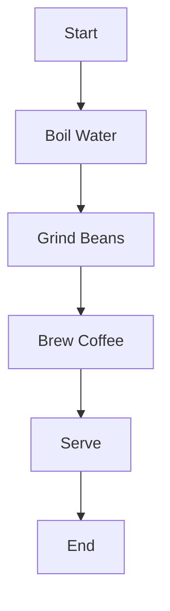

### Example 2: Decision Process
**Input:** "Create a flowchart for user registration: user fills form, validate email format, if valid create account and send confirmation, if invalid show error"

**Generated Code:**
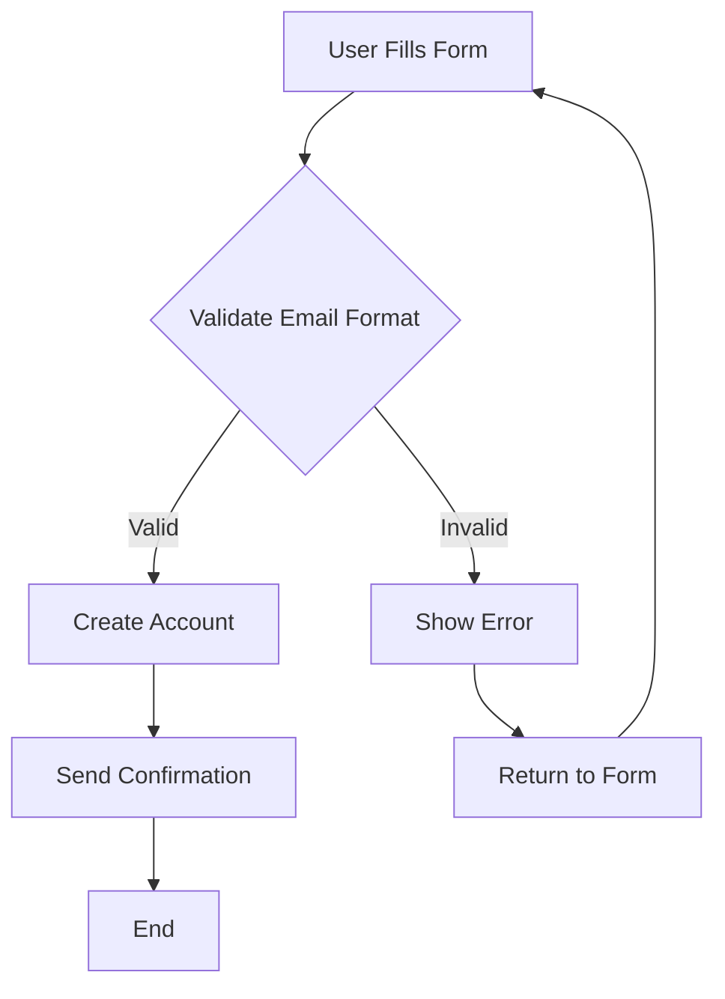

### Example 3: Complex Workflow
**Input:** "Design a flowchart for order processing: receive order, check inventory, if available process payment, if payment successful ship order, if payment fails notify customer, if inventory low reorder stock"

**Generated Code:**
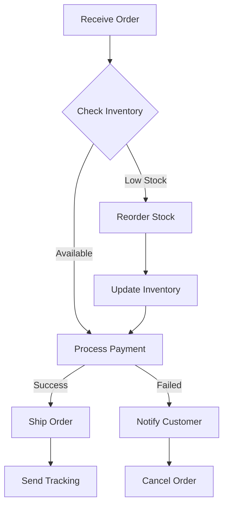

## Class Diagrams

### Example 1: Basic Inheritance
**Input:** "Create a class diagram showing Vehicle as parent class with Car and Motorcycle as children. Vehicle has brand, year, start() and stop() methods. Car has doors and openTrunk() method. Motorcycle has hasSidecar and wheelie() method."

**Generated Code:**
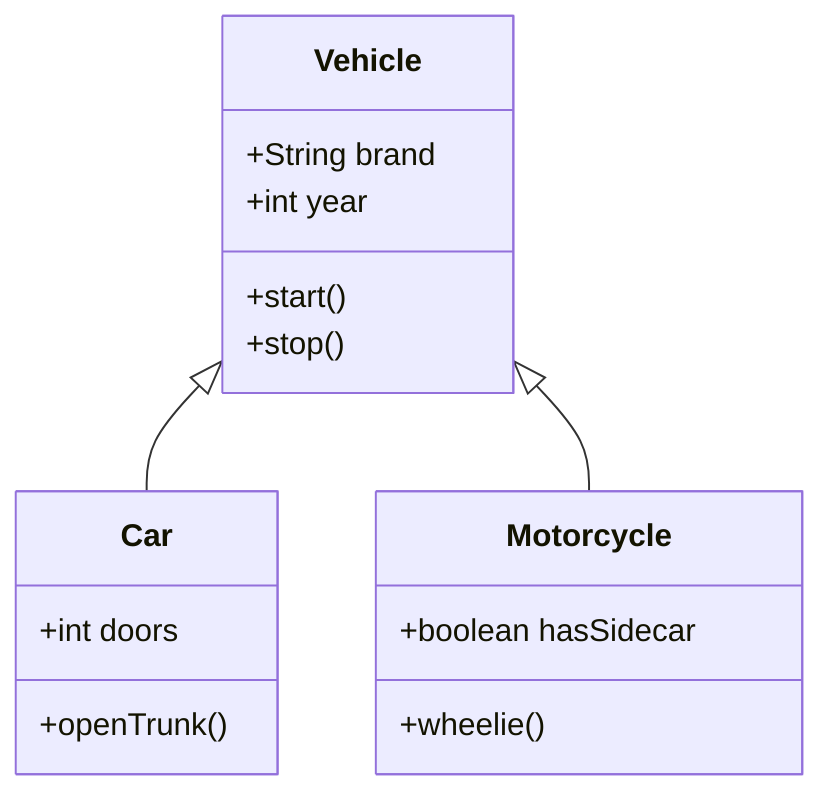

### Example 2: E-commerce System
**Input:** "Design a class diagram for an e-commerce system with User, Product, Order, and ShoppingCart classes. User has name, email, and methods to login and logout. Product has name, price, description. Order contains products and has total calculation. ShoppingCart belongs to user and can add/remove products."

**Generated Code:**
```mermaid
classDiagram
    class User {
        +String name
        +String email
        +login()
        +logout()
    }
    class Product {
        +String name
        +decimal price
        +String description
    }
    class Order {
        +Date orderDate
        +decimal total
        +calculateTotal()
        +addProduct()
    }
    class ShoppingCart {
        +addProduct()
        +removeProduct()
        +getTotal()
    }
    User ||--o{ ShoppingCart : owns
    ShoppingCart ||--o{ Product : contains
    User ||--o{ Order : places
    Order ||--o{ Product : includes
```

## Sequence Diagrams

### Example 1: User Authentication
**Input:** "Show the sequence of user login: user enters credentials, system validates format, checks database, database returns result, system responds with success or error message"

**Generated Code:**
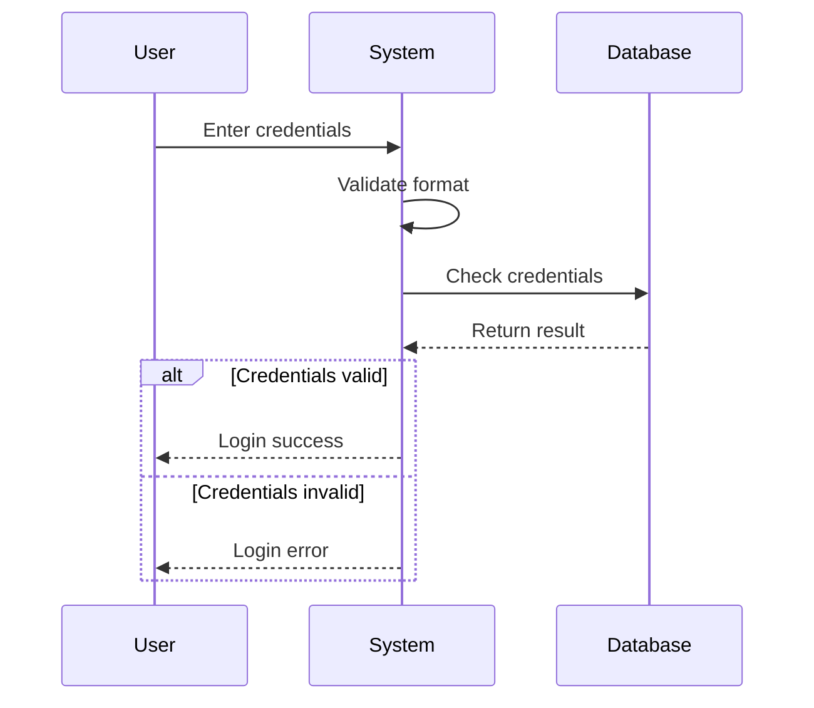

### Example 2: API Request Flow
**Input:** "Create a sequence diagram for API request processing: client sends request to API gateway, gateway authenticates with auth service, forwards to business service, business service queries database, response flows back through the chain"

**Generated Code:**
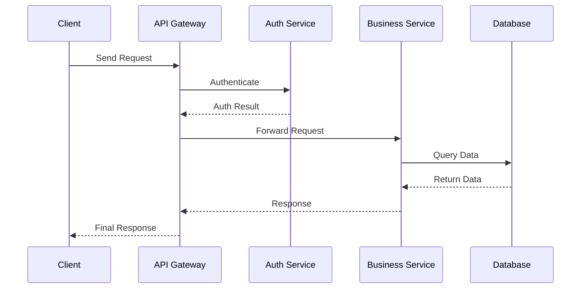

## Entity Relationship Diagrams

### Example 1: Blog System
**Input:** "Design an ER diagram for a blog system with users, posts, comments, and categories. Users can write multiple posts, posts belong to categories, posts can have multiple comments, comments are written by users"

**Generated Code:**
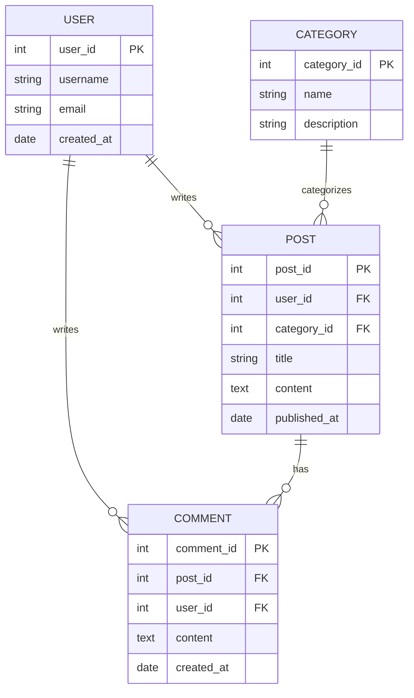

### Example 2: Library Management
**Input:** "Create an ER diagram for library management with books, authors, members, and loans. Books have multiple authors, members can borrow multiple books, loans track which member borrowed which book and when"

**Generated Code:**
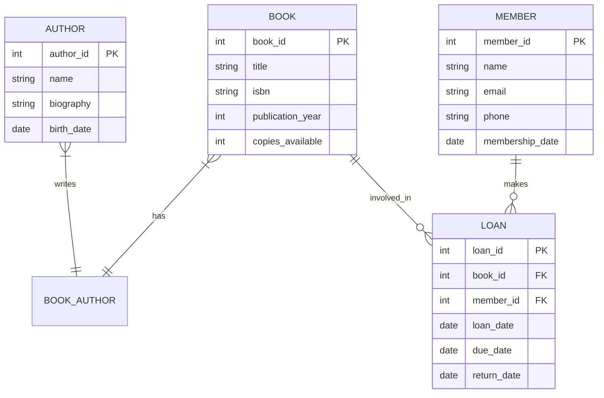

## State Diagrams

### Example 1: Order States
**Input:** "Create a state diagram for order processing with states: pending, confirmed, processing, shipped, delivered, cancelled. Orders can be cancelled from pending or confirmed states."

**Generated Code:**
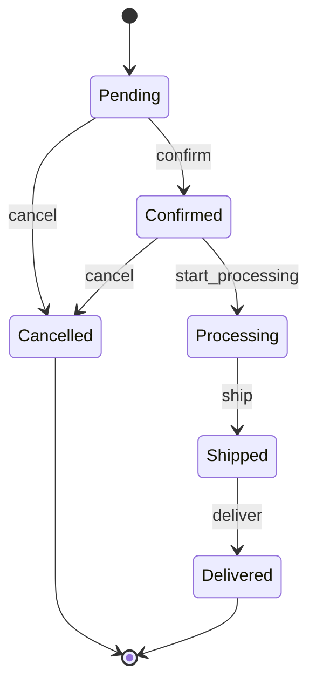

### Example 2: User Account States
**Input:** "Design a state diagram for user account lifecycle: new account starts as inactive, can be activated, active accounts can be suspended or deactivated, suspended accounts can be reactivated"

**Generated Code:**
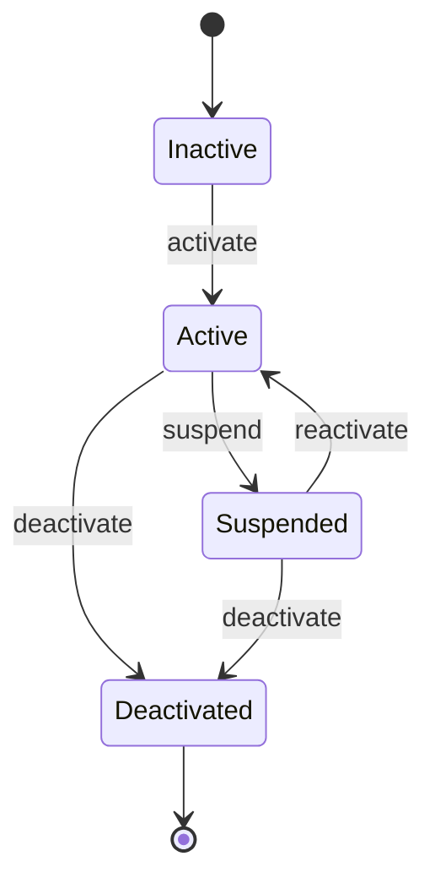

## Gantt Charts

### Example 1: Project Timeline
**Input:** "Create a Gantt chart for website development project: planning (2 weeks), design (3 weeks), development (6 weeks), testing (2 weeks), deployment (1 week). Design starts after planning, development after design, testing overlaps with development last 2 weeks"

**Generated Code:**
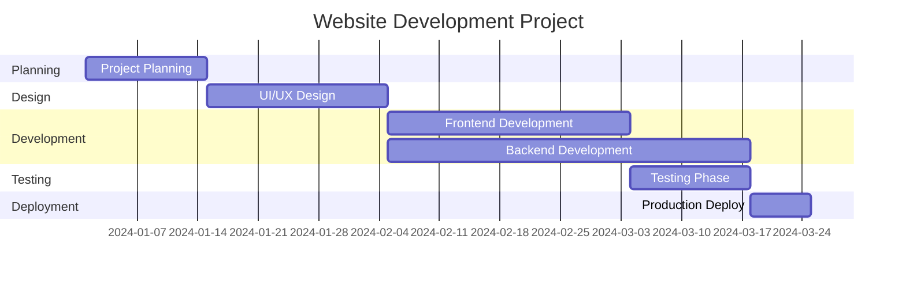

### Example 2: Marketing Campaign
**Input:** "Design a Gantt chart for marketing campaign: market research (1 week), content creation (2 weeks), campaign setup (1 week), campaign execution (4 weeks), analysis (1 week). Content creation starts after research, setup after content, execution after setup"

**Generated Code:**
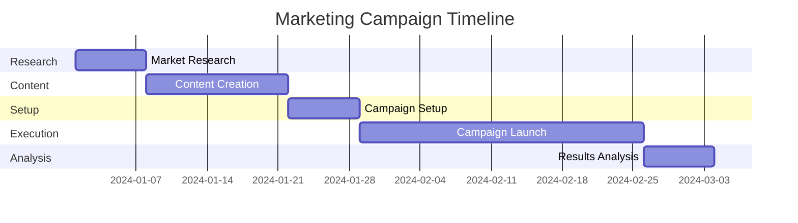

## Tips for Better Results

### 1. Be Specific and Clear
**Good:** "Create a flowchart for user registration: user fills form, system validates email, if valid create account, if invalid show error"

**Avoid:** "Make a diagram about users and registration stuff"

### 2. Use Diagram-Specific Keywords
- **Flowcharts:** "process", "decision", "if/then", "workflow"
- **Class Diagrams:** "class", "inheritance", "methods", "properties"
- **Sequence:** "interaction", "sequence", "actor", "message"
- **ER Diagrams:** "entity", "relationship", "database", "table"

### 3. Structure Complex Descriptions
**Good:** "Design a class diagram with three classes: User (name, email, login method), Product (name, price, description), Order (date, total, calculateTotal method). User can have multiple orders, orders contain multiple products."

### 4. Specify Relationships Clearly
- "A inherits from B"
- "A has many B"
- "A belongs to B"
- "A connects to B"

### 5. Include State Transitions
For state diagrams, clearly specify:
- Initial and final states
- Transition conditions
- State names

### 6. Mention Time Dependencies
For Gantt charts:
- Task durations
- Dependencies between tasks
- Start/end conditions

### 7. Use Examples for Complex Scenarios
When describing complex systems, provide concrete examples:
"For an e-commerce system, show how a customer (John) places an order for a product (iPhone), payment is processed, and order is shipped"

### 8. Avoid Ambiguous Language
**Avoid:** "maybe", "sometimes", "possibly", "and/or"
**Use:** "if", "when", "always", "either...or"

### 9. Break Down Large Systems
For complex systems, focus on one aspect at a time:
- "Show only the authentication flow"
- "Focus on the data relationships"
- "Display the main user workflow"

### 10. Specify Diagram Orientation
For flowcharts, you can specify:
- "top-down flowchart"
- "left-to-right process flow"
- "vertical decision tree"
